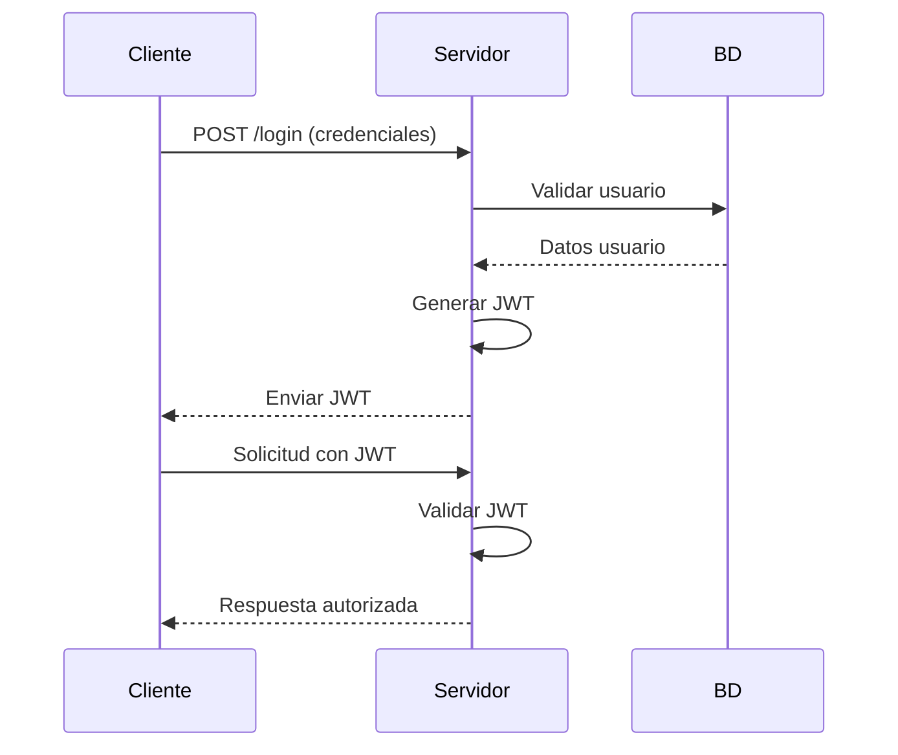
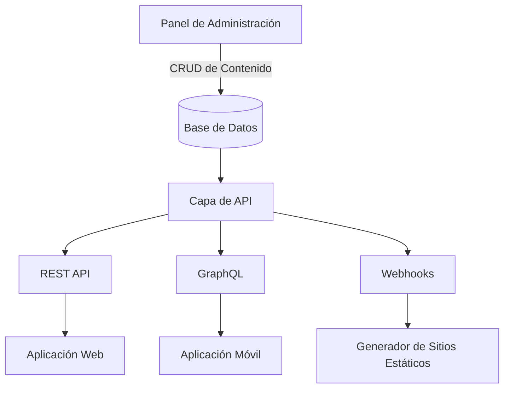
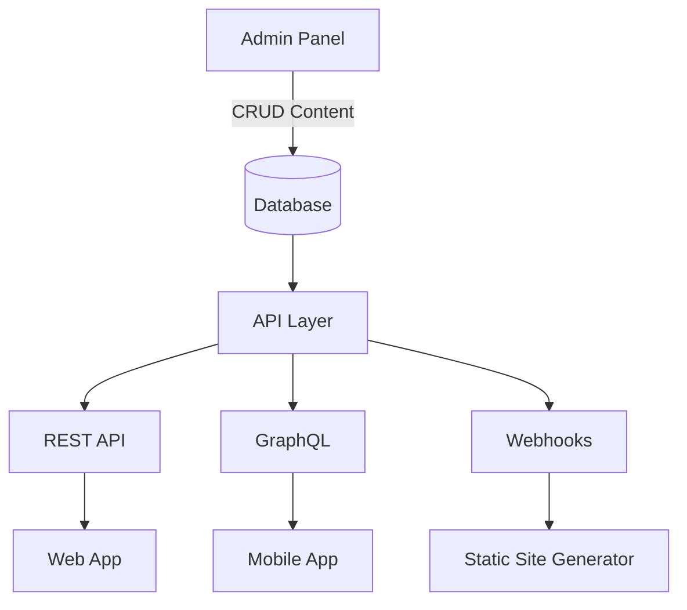
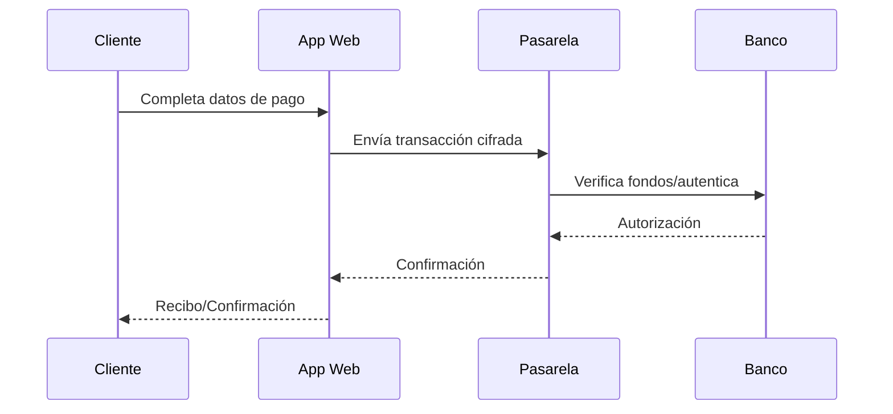
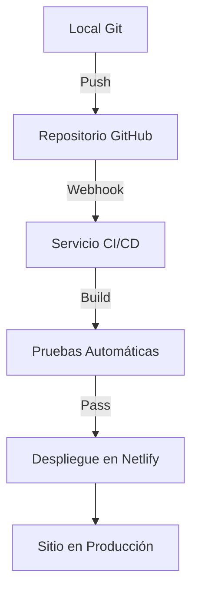

# Documentación técnica
## 💻 Laboratorio 1 – Tecnologías Web Modernas
#### Nombre: Luis Carlos Trejos Rivera
#### Carné: 2022437816
#### Curso: IC-8057 – Introducción al Desarrollo de Páginas Web
#### Fecha: 8/8/2025
------------------------------------------------
# 1. Frameworks de desarrollo web

## ¿Qué es un framework y qué problema resuelve?

Un Framework es una estructura conceptual y tecnológica de soporte que integra un conjunto de conceptos, prácticas y criterios estandarizados. Proporciona módulos de software concretos y artefactos predefinidos para resolver problemáticas específicas, basándose en soluciones probadas para problemas similares. Su propósito fundamental es servir como base organizada para el desarrollo de software, simplificando el proceso de programación mediante componentes reutilizables y patrones establecidos.

### ¿Qué problema resuelve?

- **Reduce la complejidad:** Un framework organiza el código y proporciona una estructura clara, lo que facilita la gestión y el mantenimiento de proyectos. 

- **Acelera el desarrollo:** Al ofrecer componentes y funcionalidades preconstruidas, un framework permite a los desarrolladores enfocarse en la lógica específica de la aplicación en lugar de tareas básicas. 

- **Promueve la reutilización de código:** Los frameworks fomentan la creación de componentes reutilizables que pueden usarse en diferentes partes del proyecto o incluso en futuros proyectos. 

- **Mejora la calidad y la consistencia:** Al trabajar sobre codigo ya creado, esto establece un estandar con cual medir el codigo que se va a implementar. 

- **Facilita la colaboración:** Al establecer una estructura común, se facilitan la colaboración entre diferentes desarrolladores y equipos. 


## Arquitectura general y enfoque (MVC, SPA, SSR, etc.)

En programación, la arquitectura general se refiere al diseño estructural de un sistema de software, especificando cómo se organizan los componentes y cómo interactúan entre sí. Es como un plano para un edificio, que define la estructura general y la disposición de los diferentes elementos. Esta define las decisiones estructurales clave que afectan la mantenibilidad, escalabilidad y éxito general del proyecto.  

### MVC:

La arquitectura MVC (Modelo-Vista-Controlador) es un patrón de diseño que divide una aplicación en tres componentes interconectados: Modelo, Vista y Controlador. Esta separación permite una mejor organización, mantenimiento y escalabilidad del código. 

#### Componenetes:
- **Modelo:** Representa los datos de la aplicación y la lógica de negocio. Maneja el almacenamiento y manipulación de datos, sin preocuparse por cómo se presentan.
- **Vista:** Se encarga de la UI (interfaz de usuario), mostrando los datos al usuario y recibiendo sus interacciones. No contiene lógica de negocio, solo se ocupa de la presentación.
- **Controlador:** Actúa como intermediario entre el Modelo y la Vista. Recibe las entradas del usuario desde la Vista, las procesa mediante una interacción con el Modelo, y determina qué cambios se deben realizar en la Vista. 

## Ejemplo práctico documentado (estructura de proyecto, fragmento de código comentado)

#### Estructura del Proyecto

```
mi-proyecto/
├── src/
│   ├── components/          # Componentes de la UI
│   │   ├── Button.js
│   │   └── Input.js
│   ├── models/             # Modelos de datos
│   │   └── User.js
│   ├── controllers/        # Controladores (lógica de negocio)
│   │   └── UserController.js
│   ├── views/              # Vistas (presentación)
│   │   ├── Home.js
│   │   └── Profile.js
│   ├── App.js               # Componente principal
│   └── index.js             # Punto de entrada de la aplicación
├── package.json
└── README.md
```

#### Fragmentos de Código 
##### UserController.js (Controlador)

```javascript
// Importa el modelo de usuario (si es necesario)
import User from '../models/User';

class UserController {
  constructor() {
    // Lógica de inicialización, si es necesario
  }

  // Método para obtener todos los usuarios
  async getAllUsers() {
    try {
      // Aquí iría la lógica para obtener datos de una base de datos,
      // una API, etc.
      const users = [
        { id: 1, name: 'Juan Perez' },
        { id: 2, name: 'Maria Gomez' },
      ];
      return users;
    } catch (error) {
      console.error('Error obteniendo usuarios:', error);
      return []; // Manejo de errores
    }
  }

  // Método para crear un nuevo usuario
  async createUser(userData) {
    try {
      // Aquí iría la lógica para crear un nuevo usuario en la base de datos
      const newUser = new User(userData.name, userData.email); // Ejemplo
      // Guardar el usuario en la base de datos
      // await newUser.save();
      return newUser;
    } catch (error) {
      console.error('Error creando usuario:', error);
      return null; // Manejo de errores
    }
  }
}

export default UserController;
```

##### Home.js (Vista)

```javascript
import React, { useState, useEffect } from 'react';
import UserController from '../controllers/UserController';
import Button from '../components/Button'; // Importa el componente Button

function Home() {
  const [users, setUsers] = useState([]);
  const [newUser, setNewUser] = useState({ name: '', email: '' });
  const userController = new UserController(); // Instancia del controlador

  useEffect(() => {
    // Cargar usuarios al montar el componente
    async function fetchUsers() {
      const usersData = await userController.getAllUsers();
      setUsers(usersData);
    }
    fetchUsers();
  }, []); // El segundo argumento [] asegura que se ejecute solo una vez al montar

  const handleInputChange = (e) => {
    setNewUser({ ...newUser, [e.target.name]: e.target.value });
  };

  const handleCreateUser = async () => {
    const createdUser = await userController.createUser(newUser);
    if (createdUser) {
      setUsers([...users, createdUser]);
      setNewUser({ name: '', email: '' }); // Limpiar formulario
    }
  };

  return (
    <div>
      <h1>Lista de Usuarios</h1>
      <ul>
        {users.map((user) => (
          <li key={user.id}>{user.name}</li>
        ))}
      </ul>

      <h2>Crear Nuevo Usuario</h2>
      <input
        type="text"
        name="name"
        value={newUser.name}
        onChange={handleInputChange}
        placeholder="Nombre"
      />
      <input
        type="email"
        name="email"
        value={newUser.email}
        onChange={handleInputChange}
        placeholder="Email"
      />
      <Button onClick={handleCreateUser} text="Crear Usuario" />
    </div>
  );
}

export default Home;
```


## Comparación breve entre al menos dos frameworks

Frameworks como Angular y React son herramientas clave, pero difieren en su enfoque. Ya que Angular es un framework completo, ofrece una estructura robusta y completa, mientras que React, una biblioteca, se centra en la interfaz de usuario y se integra con otras herramientas para construir aplicaciones completas. 

### Angular:

- **Estructura:** Este proporciona una estructura rígida y completa para el desarrollo web, con reglas y patrones ya definidos.
- **Enfoque:** Se centra en el desarrollo de aplicaciones web complejas y de gran escala.
- **Complejidad:** Tiene una curva de aprendizaje más pronunciada debido a su complejidad y características.
- **Control:** Este framework controla la estructura y el flujo de la aplicación.
- **Ventajas:** Ideal para proyectos grandes, ofrece un sistema de plantillas y un ecosistema robusto.
- **Desventajas:** Puede ser menos flexible para proyectos pequeños o con requerimientos muy específicos. 

### React:

- **Estructura:** React es una biblioteca que se enfoca en la capa de vista, permitiendo crear interfaces de usuario dinámicas.
- **Enfoque:** Se utiliza principalmente para construir interfaces de usuario y se integra con otras bibliotecas y herramientas para funcionalidades adicionales.
- **Flexibilidad:** Ofrece mayor flexibilidad para elegir las herramientas y tecnologías necesarias para cada proyecto.
- **Control:** El desarrollador tiene más control sobre la estructura y el flujo de la aplicación.
- **Ventajas:** Es ideal para proyectos de cualquier tamaño, es flexible, tiene un gran ecosistema de librerías y herramientas, y posee un rendimiento optimizado.
- **Desventajas:** Requiere la integración con otras herramientas para construir aplicaciones completas, lo que puede aumentar la complejidad. 


# 2. Control de versiones y trabajo colaborativo

## ¿Qué es el control de versiones y por qué es esencial?

El control de versiones es un sistema que registra los cambios realizados en un archivo o conjunto de archivos a lo largo del tiempo. Permite a los usuarios recuperar versiones anteriores, comparar cambios y colaborar de manera más eficiente, especialmente en proyectos de software complejos. Esencialmente, actúa como un historial de cambios, similar a guardar partidas en un videojuego, pero aplicado a archivos digitales. 

### ¿Por qué es esencial?

- **Recuperación de versiones anteriores:** Facilita la vuelta a estados previos del proyecto si se cometen errores o se desea explorar diferentes caminos de desarrollo. 
- **Colaboración eficiente:** Permite que múltiples desarrolladores trabajen en el mismo proyecto de forma simultánea, sin temor a sobrescribir el trabajo de otros. 
- **Gestión de conflictos:** Ayuda a resolver conflictos que surgen cuando varios desarrolladores modifican la misma parte de un archivo. 
- **Seguimiento de cambios:** Permite conocer quién realizó qué cambios y cuándo, facilitando la depuración y la auditoría. 
- **Mayor calidad del código:** Al facilitar la revisión y comparación de versiones, fomenta la detección temprana de errores y la mejora continua del código. 
- **Backups automáticos:** Evita la pérdida de datos al mantener un historial de todas las versiones del proyecto.

## Conceptos clave: repositorio, commit, branch, merge, pull request

- **Repositorio:** Es el lugar donde se guarda todo el código fuente de un proyecto, junto con su historial de cambios. Puede ser local o remoto (en un servidor como GitHub, GitLab, etc.). 
- **Commit:** Un commit es un registro de los cambios realizados en el repositorio en un momento específico. Cada commit incluye un mensaje que describe los cambios realizados, creando una especie de "fotografía" del estado del proyecto en ese instante. 
- **Rama (Branch):** Una rama es una línea de desarrollo separada del código principal (generalmente llamada main o master). Permite trabajar en nuevas características o correcciones de errores sin afectar la rama principal. 
- **Merge:** La fusión es el proceso de combinar los cambios de una rama con otra. Por ejemplo, se pueden fusionar los cambios de una rama de características con la rama principal. 
- **Pull Request:** Un pull request es una forma de solicitar que los cambios realizados en una rama sean integrados a otra, generalmente la rama principal. Es una práctica común para la revisión de código, donde otros desarrolladores pueden revisar los cambios propuestos y dar su opinión antes de que sean fusionados. 

    
## Ejemplo de cómo usar Git en un proyecto (inicialización, commits, ramas)

### Gitflow:

- **Propósito:** Proporciona un flujo de trabajo estructurado para gestionar lanzamientos, especialmente en proyectos grandes con múltiples desarrolladores y la necesidad de lanzamientos estructurados.

- **Ramas (Principal o Maestra):** Representa el código oficial de lanzamiento.

- **Desarrollo:** Rama de integración para nuevas funcionalidades.

- **Ramas de funcionalidad:** Creadas para nuevas funcionalidades y fusionadas con desarrollo.

- **Ramas de lanzamiento:** Creadas desde desarrollo para preparar un nuevo lanzamiento.

- **Ramas de revisión:** Creadas desde principal para corregir errores críticos en producción.

- **Ventajas:** Separación clara del código, gestión de lanzamientos optimizada, ideal para proyectos complejos.

- **Desventajas:** Puede ser más compleja de gestionar, menos adecuada para CI/CD rápida.

## Herramientas recomendadas (GitHub, GitLab, Bitbucket)

#### GitHub:
- Es conocido por su gran comunidad, amplia gama de herramientas y la facilidad para encontrar proyectos open source. 
- Ideal para proyectos públicos y colaboración en equipo, especialmente en proyectos grandes. 
- Ofrece un ecosistema robusto de integraciones y herramientas de terceros. 
#### GitLab:
- Se destaca por su enfoque en el ciclo completo de desarrollo de software, incluyendo CI/CD, gestión de proyectos y seguridad.
- Una buena opción para equipos que buscan una solución integral para todo el proceso de desarrollo.
- Ofrece una interfaz intuitiva y herramientas para equipos de DevOps. 

# 3. Autenticación y seguridad moderna

## Conceptos: autenticación, autorización, tokens, JWT, OAuth

- La autenticación es el proceso de verificar la identidad de un usuario, mientras que la autorización determina a qué recursos puede acceder ese usuario una vez autenticado. 
- Los tokens son credenciales digitales que se utilizan para representar la autenticación y autorización de un usuario, permitiendo el acceso a servicios y recursos. 
- JWT (JSON Web Token) es un formato de token común para la transmisión segura de información de autenticación.
- OAuth es un protocolo de autorización que permite a las aplicaciones acceder a recursos en nombre de un usuario, sin necesidad de compartir sus credenciales directamente. 

## Diagrama de flujo explicativo del proceso de autenticación con JWT



## Buenas prácticas en seguridad web
Manejo de tokens:

Usar HTTP-only cookies para almacenar tokens

Implementar refresh tokens con expiración corta (15-30 min)

Nunca exponer tokens en URLs

Protección de datos:

Hash de contraseñas con bcrypt/PBKDF2

Validar y sanitizar TODOS los inputs de usuario

## Aplicaciones reales en plataformas modernas

Redes Sociales:

Facebook: Usa OAuth 2.0 + tokens propios

Twitter: Implementa autenticación multifactor

Servicios Cloud:

AWS: Credenciales temporales con IAM

GitHub: Personal Access Tokens (PATs)


# 4. Gestores de contenido desacoplados (Headless CMS)

## Definición de Headless CMS vs CMS tradicional.

Un Headless CMS (CMS sin cabeza) y un CMS tradicional son dos enfoques distintos para la gestión de contenido, con diferencias clave en la forma en que manejan la presentación del contenido. Un CMS tradicional, como WordPress, combina la gestión del contenido (back-end) con la presentación del mismo (front-end), mientras que un Headless CMS separa estas dos capas. En un Headless CMS, el contenido se almacena y gestiona en el back-end, pero se entrega a través de una API para ser mostrado en cualquier front-end (sitio web, aplicación, etc.) que el usuario prefiera, sin estar limitado por la plantilla o estructura del CMS. 

### CMS Tradicional:

 - Enfoque: Combina la gestión del contenido y la presentación en una sola plataforma. 
 - Características: Generalmente incluye plantillas predefinidas para la creación y visualización de contenido. 
 - Limitaciones: Puede ser restrictivo en términos de diseño y flexibilidad, especialmente en la entrega de contenido a diferentes canales. 
 - Ventajas: Fácil de usar para usuarios no técnicos, con una curva de aprendizaje más baja en muchos casos. 

### Headless CMS:

 - Enfoque:Separa la gestión del contenido del front-end. 
 - Características: Entrega contenido a través de APIs, permitiendo una mayor flexibilidad en la elección de tecnologías de front-end. 
 - Ventajas: Mayor flexibilidad en el diseño y la presentación, escalabilidad, y la capacidad de entregar contenido a múltiples canales. 
- Desventajas: Requiere conocimientos técnicos para la implementación y gestión del front-end, y puede ser más complejo en algunos casos. 

## Arquitectura basada en APIs.

La arquitectura utilizada en un Headless CMS se centra en la separación clara entre la gestión de contenido y su presentación, utilizando APIs como puente. Su estructura se detallada en:

### Componentes principales:

1. **Capa de administración**  
   - Interfaz para crear/editar contenido (editor WYSIWYG)  
   - Gestión de usuarios y permisos  
   - Definición de estructuras de contenido (modelos)  

2. **Capa de almacenamiento**  
   - Base de datos para contenido estructurado  
   - Almacenamiento de medios (imágenes, videos)  
   - Versióning y historial de cambios  

3. **Capa de entrega (API)**  
   - **REST API**: Endpoints estándar HTTP/HTTPS  
   - **GraphQL**: Consultas específicas bajo demanda  
   - **Webhooks**: Notificaciones para sincronización  

4. **Capa de consumo**  
   - Aplicaciones web (React, Angular, Vue)  
   - Apps móviles (iOS/Android)  
   - Dispositivos IoT (pantallas digitales, wearables)  



## Ventajas, limitaciones y casos de uso comunes.

| Aspecto | Ventajas | Limitaciones | Casos de Uso |
| --- | --- | --- | --- |
| Flexibilidad | Multiplataforma (web/móvil/IoT) | Requiere desarrollo frontend custom | Aplicaciones Omnicanal |
| Rendimiento | Mejor escalabilidad | Dependencia de APIs externas | Páginas marketing high-traffic |
| Seguridad | Menor superficie de ataque | Complejidad en previews de contenido | E-commerce con React/Vue |
| Actualizaciones | Despliegues independientes | Costo inicial más alto | Blogs multi-dispositivo |

## Ejemplo de cómo se conecta el frontend a un CMS headless.

La arquitectura de un Headless CMS se centra en la separación clara entre la gestión de contenido y su presentación, utilizando APIs como puente. Esta es su estructura detallada:

### Componentes principales:

1. **Capa de administración**  
   - Interfaz para crear/editar contenido (editor WYSIWYG)  
   - Gestión de usuarios y permisos  
   - Definición de estructuras de contenido (modelos)  

2. **Capa de almacenamiento**  
   - Base de datos para contenido estructurado  
   - Almacenamiento de medios (imágenes, videos)  
   - Versióning y historial de cambios  

3. **Capa de entrega (API)**  
   - **REST API**: Endpoints estándar HTTP/HTTPS  
   - **GraphQL**: Consultas específicas bajo demanda  
   - **Webhooks**: Notificaciones para sincronización  

4. **Capa de consumo**  
   - Aplicaciones web (React, Angular, Vue)  
   - Apps móviles (iOS/Android)  
   - Dispositivos IoT (pantallas digitales, wearables)  

#### Diagrama Ejemplo:

### Conexión con Contentful (React):

1.  Instalar SDK:

```bash

npm install contentful
```
2.  Configurar cliente:

```javascript

import { createClient } from 'contentful';

const client = createClient({
  space: 'YOUR_SPACE_ID',
  accessToken: 'YOUR_ACCESS_TOKEN'
});
```
3.  Obtener contenido:

```javascript

// Obtener posts de blog
async function getBlogPosts() {
  const response = await client.getEntries({
    content_type: 'blogPost',
    order: '-sys.createdAt'
  });
  return response.items;
}
```
4.  Mostrar en React:

```jsx

function BlogList() {
  const [posts, setPosts] = useState([]);

  useEffect(() => {
    getBlogPosts().then(data => setPosts(data));
  }, []);

  return (
    <div>  {posts.map(post => (
        <article key={post.sys.id}>  <h2>{post.fields.title}</h2>  <p>{post.fields.content}</p>  </article>
      ))}  </div>
  );
}
```
# 5. Pasarelas de pago en aplicaciones web

## ¿Qué es una pasarela de pago? ¿Qué rol cumple en una aplicación moderna?

**Definición:**  
Sistema que procesa transacciones financieras entre compradores y vendedores en entornos digitales. Actúa como intermediario entre tu aplicación y las redes bancarias.

**Roles clave:**  
- Cifrado de datos sensibles (tarjetas, cuentas)  
- Procesamiento de múltiples métodos de pago (tarjetas, transferencias, wallets)  
- Conversión de divisas (para pagos internacionales)  
- Gestión de reembolsos y disputas  
- Cumplimiento de estándares PCI-DSS  

**Ejemplo de flujo básico:**  

## Requisitos comunes
---------------------

| Requisito | Descripción | Ejemplo |
| --- | --- | --- |
| Cuenta de comercio | Registro como vendedor en la plataforma | Stripe Connect, PayPal Business |
| Certificación PCI | Cumplimiento de seguridad para manejo de datos de pago | Nivel 1 PCI-DSS |
| Integración técnica | API/SDK para conectar con el backend | Stripe.js, PayPal Checkout SDK |
| Soporte legal | Términos y condiciones adaptados a tu región | Facturación electrónica (México) |
| Costos | Comisiones por transacción (+ posibles tarifas fijas) | 2.9% + $0.30 (Stripe estándar) |

## Ventajas y limitaciones

### Ventajas:

-   Reducción de fraude (protección AVS/CVV)

-   Checkout optimizado (mayor conversión)

-   Soporte multi-método (Apple/Google Pay)

-   Reconcilización automática

### Limitaciones:

-   Costos por transacción

-   Requiere SSL/TLS (HTTPS obligatorio)

-   Retenciones por riesgo (hold de fondos)

-   Curva de aprendizaje en APIs

## Comparación entre pasarelas

| Característica | Stripe | PayPal | TiloPay (Costa Rica) |
| --- | --- | --- | --- |
| Métodos soportados | Tarjetas, Wallet, Link | Tarjetas, Balance PayPal | Tarjetas, SINPE móvil |
| Comisión típica | 2.9% + $0.30 | 3.5% + $0.30 | 2.75% + ₡100 |
| Tiempo transferencia | 2-7 días | 1 día hábil | Instantáneo (SINPE) |
| Requerimientos | Cuenta internacional | Verificación KYC | Cédula jurídica |
| Fortaleza | Developer-friendly | Reconocimiento global | Solución local |

# 6. Automatización del despliegue y hosting moderno

## ¿Qué es CI/CD y por qué se usa en desarrollo web?

**CI/CD** (Integración Continua/Despliegue Continuo) es una práctica que automatiza:  
- **Integración Continua**: Fusión automática de cambios de código con pruebas unitarias  
- **Despliegue Continuo**: Publicación automática en entornos de producción  

**Beneficios clave**:  
- Detección temprana de errores (antes de llegar a producción)  
- Despliegues más rápidos y confiables  
- Reducción de trabajo manual repetitivo  

**Ejemplo con GitHub Actions**:  
```yaml
name: CI/CD Pipeline
on: [push]
jobs:
  build:
    runs-on: ubuntu-latest
    steps:
      - uses: actions/checkout@v2
      - run: npm install && npm run build
  deploy:
    needs: build
    runs-on: ubuntu-latest
    steps:
      - uses: actions/checkout@v2
      - run: npm install -g netlify-cli
      - run: netlify deploy --prod
```

## Hosting estático vs dinámico

| Característica | Hosting Estático (Netlify, Vercel) | Hosting Dinámico (AWS EC2, Heroku) |
| --- | --- | --- |
| Contenido | Archivos pre-construidos (HTML/CSS/JS) | Generado en tiempo real (PHP, Node.js) |
| Escalabilidad | Alta (CDN global) | Requiere configuración manual |
| Costo | Gratis para proyectos pequeños | Generalmente más costoso |
| Mantenimiento | Cero administración de servidor | Requiere parches/actualizaciones |
| Ejemplo | Sitios con Markdown (como este laboratorio) | Aplicaciones con bases de datos |


## Flujo de despliegue automatizado


## Documentar el proceso seguido para desplegar la parte 2 del laboratorio

### 1. Preparación inicial
```bash
# Crear estructura de archivos local
mkdir desarrollo-moderno-nombre
cd desarrollo-moderno-nombre
git init
```
#### Archivos requeridos:
```
├── index.html  # Archivo provisto por el docente
├── README.md   # Documentación completa del laboratorio
└── assets/     # (Opcional) Para imágenes/archivos estáticos
```
### 2. Configuración de Git

```bash
# Inicializar repositorio
git branch -M main
git add .
git commit -m "Initial commit with lab documentation"
```

### 3. Conexión con GitHub

- Crear nuevo repositorio en GitHub
- Vincular repositorio local:

```bash

git remote add origin https://github.com/LuisK19/LAB-1-WEB
git push -u origin main
```

### 4. Despliegue en Netlify

#### Método 1: Arrastre y suelte

1.  Acceder a [app.netlify.com](https://app.netlify.com/)
2.  Arrastrar carpeta del proyecto a la zona "Drag and drop your site folder here"

#### Método 2: Conexión con GitHub

```bash
# Instalar CLI de Netlify
npm install netlify-cli -g

# Autenticación
netlify login

# Despliegue inicial
netlify deploy --prod
```

### 5. Configuración final en Netlify

-   Build settings (automáticos para sitios estáticos):
    ```text

    Build command: (dejar vacío)
    Publish directory: / (o la carpeta que contenga index.html)
    ```
-   Dominio:Se Asigna automática (ej: `https://lab1.netlify.app`)

-   HTTPS: Activado automáticamente por Netlify

### 6. Verificación del sitio

1.  Acceder a la URL proporcionada por Netlify

2.  Confirmar que:

    -   La página carga sin errores en la consola

    -   El contenido de README.md se renderiza correctamente

    -   Los diagramas Mermaid se visualizan adecuadamente

## Referencias:

- https://www.codecademy.com/article/mvc-architecture-model-view-controller
- https://www.netec.com/post/que-es-un-framework-y-para-que-se-utiliza
- https://openwebinars.net/blog/arquitectura-de-software-que-es-y-que-tipos-existen/
- https://luisaalfaro.github.io/lovelace-blog/2020-09-28-merge-pull-requests/
- https://www.gitkraken.com/learn/git/tutorials/what-is-a-pull-request-in-git#:~:text=Una%20solicitud%20de%20incorporaci%C3%B3n%20de,un%20registro%20hist%C3%B3rico%20del%20desarrollo.
- https://www.codehoven.com/git-comandos-y-conceptos
- https://aulab.es/noticia/24/github-bitbucket-gitlab-las-diferencias#:~:text=Github%2C%20Bitbucket%20y%20Gitlab%20son,el%20mundo%20de%20la%20inform%C3%A1tica.
- https://www.ionos.com/es-us/digitalguide/paginas-web/desarrollo-web/bitbucket-vs-github/
- https://zuplo.com/learning-center/top-7-api-authentication-methods-compared
- https://frontegg.com/blog/oauth-vs-jwt#:~:text=Funci%C3%B3n%20principal:%20OAuth%20se%20utiliza,otro%20tipo%20de%20token%20OAuth.
- https://curity.io/resources/learn/jwt-best-practices/
- https://auth0.com/docs/secure/tokens/json-web-tokens
- https://www.contensis.com/community/blog/headless-cms-vs-traditional-cms#:~:text=TL;DR%20Diferencias%20entre%20un,fant%C3%A1stico%20que%20definitivamente%20deber%C3%ADas%20probar.
- https://www.sitecore.com/explore/topics/content-management/headless-cms-vs-traditional-cms
- https://www.kentico.com/discover/blog/should-you-really-go-for-a-headless-cms-pros-and-cons
- https://medium.com/elca-it/the-pros-and-cons-of-headless-architecture-1151d7633f3c
- https://www.hostinger.com/es/tutoriales/headless-cms#:~:text=Un%20headless%20CMS%20es%20un,entrega%20de%20contenido%20entre%20plataformas.
